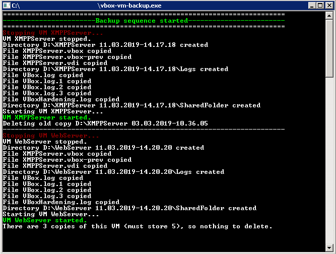

# vbox-vm-backup

Command line utility to make backups of Oracle VirtualBox virtual machines



## Requirements
Windows, .NET Framework 4.5

## Download

Current version - 0.1.1-alpha, [can be dowloaded here.](https://github.com/u1035/vbox-vm-backup/releases/tag/0.1.1-alpha) Be careful - may contain bugs)

## How it works

It sends shutdown signal to VM (emulating pressing ACPI power button), waits for it's correct shutdown, copies all VM files to specified folder and then starts VM back. Then waits some time for VM starts, and proceeding to the next VM.
Program processes virtual machines sequentally, one by one, to decrease overall downtime and disk load.

This utility is designed to be started manually or by Windows Task Scheduler (you should make a task manually), makes a log file of it's work (**vbox-vm-backup.log** in program folder) and uses XML config file (**settings.xml** in program folder).

## Installation

Just copy **vbox-vm-backup.exe** and your **settings.xml** to any folder on your disk and add a task to run executable in Windows Task Manager.

## Settings

Example settings.xml included in release package and rather intuitive:

```XML
<?xml version="1.0"?>
<ArrayOfVMInfo xmlns:xsi="http://www.w3.org/2001/XMLSchema-instance" xmlns:xsd="http://www.w3.org/2001/XMLSchema">
  <VMInfo>
    <VMName>XMPPServer</VMName>
    <SourcePath>C:\Users\user\Desktop\VMs\XMPPServer\</SourcePath>
    <DestPath>D:\</DestPath>
    <NumberOfCopies>7</NumberOfCopies>
    <WaitVMToStart>90000</WaitVMToStart>
    <VBoxInstallPath>C:\Program Files\Oracle\VirtualBox\</VBoxInstallPath>
  </VMInfo>
  <VMInfo>
    <VMName>WebServer</VMName>
    <SourcePath>C:\Users\user\Desktop\VMs\WebServer\</SourcePath>
    <DestPath>D:\</DestPath>
    <NumberOfCopies>7</NumberOfCopies>
    <WaitVMToStart>90000</WaitVMToStart>
    <VBoxInstallPath>C:\Program Files\Oracle\VirtualBox\</VBoxInstallPath>
  </VMInfo>
</ArrayOfVMInfo>
```

There are two example VMs - XMPPServer and WebServer (these are VM names in VirtualBox Control Panel).

So program copies files from `C:\Users\user\Desktop\VMs\XMPPServer` to `D:\XMPPServer_Date-Time`

Waits for 90 seconds (**WaitVMToStart**), allowing first VM to start.

Then goes for next VM - `C:\Users\user\Desktop\VMs\WebServer` to `D:\WebServer_Date-Time`

If there are more copies of this VM, then **NumberOfCopies**, oldest copies are deleted.

**VBoxInstallPath** is a path to VirtualBox executables (VBoxManage.exe and VirtualBoxVM.exe).
